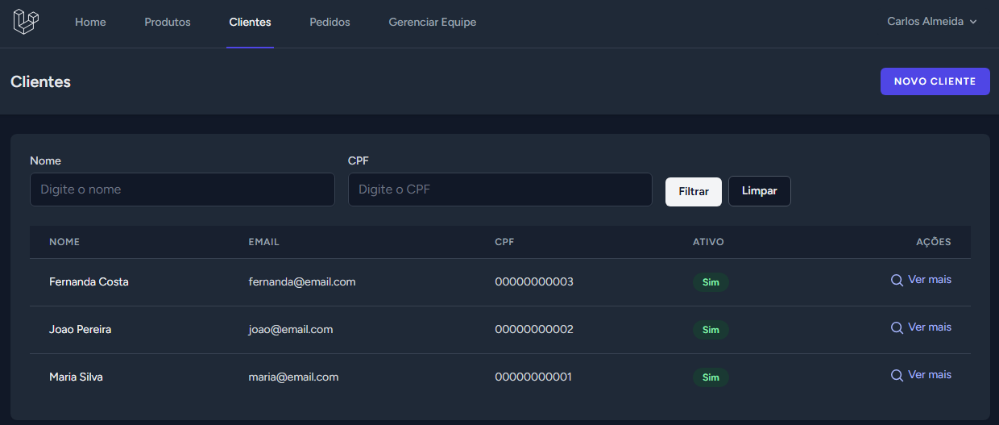
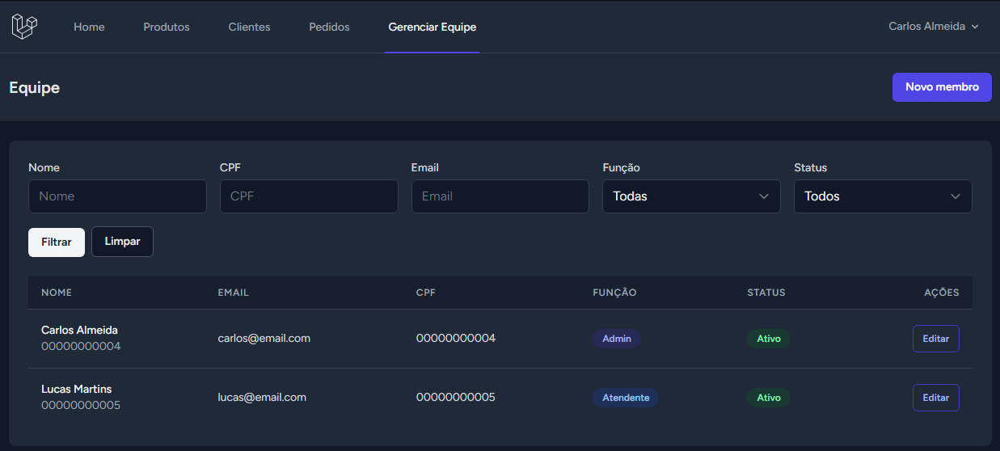
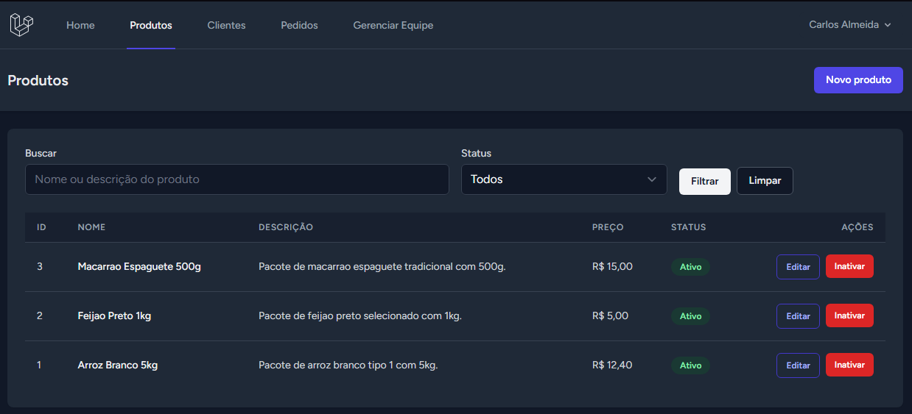

# Mini ERP em Laravel


Projeto desenvolvido em Laravel simulando um mini ERP com regras de negócio reais, controle de acesso por perfil e fluxo completo de usuários, produtos e pedidos.

A proposta deste sistema foi ir além de um CRUD simples e usar o projeto como laboratório para entender, na prática, como uma aplicação Laravel é estruturada de forma mais organizada e próxima de um cenário real.

---

## Visão geral

Objetivos:

- consolidar o aprendizado de Laravel de forma prática
- servir como projeto de portfólio para GitHub e LinkedIn

Durante o desenvolvimento, foram trabalhados conceitos fundamentais do ecossistema Laravel, incluindo Blade, Eloquent, middlewares e fluxo de requisição.

---

## Tipo de projeto

Projeto pessoal desenvolvido para estudo e construção de portfólio em Laravel.

---

## Funcionalidades do sistema

### Autenticação e fluxo inicial
- login
- cadastro público de cliente
- troca obrigatória de senha para usuários criados internamente
- fluxo de completar cadastro para cliente

### Clientes
- listagem de clientes
- filtro por nome e CPF
- cadastro de cliente
- edição de cliente
- visualização dos dados do cliente
- gerenciamento de endereços do cliente
- gerenciamento de pedidos do cliente

### Equipe
- listagem de membros internos
- filtros por nome, CPF, email, função e status
- criação de atendente e admin
- edição de membros da equipe
- proteção contra auto inativação e alteração da própria role

### Produtos
- cadastro de produtos
- edição de produtos
- ativação e inativação
- controle de produtos ativos para compra

### Endereços
- cadastro de endereços
- edição de endereços
- definição de principal
- ativação e inativação
- gerenciamento pelo cliente e pela equipe

### Pedidos
- criação de pedido pelo cliente
- criação de pedido pela equipe para um cliente
- listagem de pedidos
- visualização detalhada
- cancelamento de pedido aberto
- finalização de pedido aberto pela equipe
- snapshot do endereço de entrega salvo no pedido

---

## Perfis de acesso

### Cliente
Pode:
- completar e editar o próprio cadastro
- gerenciar os próprios endereços
- comprar produtos
- visualizar os próprios pedidos
- cancelar pedido aberto

Não pode:
- alterar email
- alterar CPF
- alterar role
- finalizar pedido
- reabrir pedido

### Atendente
Pode:
- cadastrar clientes
- editar dados permitidos dos clientes
- gerenciar endereços dos clientes
- gerenciar produtos
- criar pedidos para clientes
- cancelar pedidos abertos
- finalizar pedidos abertos

Não pode:
- alterar email
- alterar CPF
- alterar role
- reabrir pedido

### Admin
Pode:
- tudo que o atendente faz
- gerenciar equipe interna
- criar atendente e admin
- alterar CPF
- alterar role
- ativar e inativar usuários

Não pode:
- alterar email
- reabrir pedido

---

## Regras de negócio implementadas

- email é imutável para qualquer usuário
- produto não é deletado, apenas ativado ou inativado
- pedido aberto pode ser cancelado
- pedido aberto pode ser finalizado pela equipe
- pedido finalizado ou cancelado não pode ser reaberto
- somente endereço ativo pode ser principal
- somente um endereço principal por cliente
- usuários criados internamente recebem senha provisória
- usuários internos precisam trocar a senha no primeiro login

---

## Arquitetura adotada

A aplicação foi refatorada para centralizar o sistema na entidade `users`.

Em vez de existir uma entidade separada de cliente, o sistema passou a trabalhar com:

- `users`
- `roles`

Perfis cadastrados:
- `cliente`
- `atendente`
- `admin`

Essa decisão tornou a modelagem mais coerente, porque todos os perfis são usuários do sistema com regras diferentes.

---

## Relacionamentos praticados

- `User belongsTo Role`
- `User hasMany Endereco`
- `User hasMany Pedido`
- `Pedido belongsTo User`
- `Pedido hasMany ItemPedido`
- `ItemPedido belongsTo Pedido`
- `ItemPedido belongsTo Produto`
- `Produto hasMany ItemPedido`

Este projeto foi importante para consolidar, na prática, o uso de `hasMany`, `belongsTo`, `with`, `withCount`, `load` e modelagem relacional com Eloquent.

---

## Tecnologias utilizadas

- PHP
- Laravel
- Laravel Breeze
- Blade
- Tailwind CSS
- Vite
- SQLite
- Laravel Herd

---

## Ambiente de desenvolvimento

- Windows
- Laravel Herd
- domínio `.test`
- banco local em `database/database.sqlite`

---

## Conceitos de Laravel praticados

- rotas
- controllers
- resource controllers
- Blade
- formulários
- validação
- migrations
- models
- Eloquent ORM
- relacionamentos
- autenticação
- middlewares customizados
- paginação
- filtros com query string
- sessões
- transações com `DB::transaction()`
- controle de acesso por perfil

---

## Middlewares e fluxo de acesso

O projeto também serviu para praticar controle de fluxo com middlewares, incluindo:

- usuário autenticado
- usuário ativo
- troca obrigatória de senha
- perfil completo para cliente
- autorização por role

Isso ajudou a entender melhor como o Laravel trata o fluxo real de uma requisição antes de chegar no controller.

---

## Aprendizados principais

Entre os aprendizados mais importantes com este projeto:

- entender melhor a diferença entre Laravel e PHP puro
- consolidar o uso de Blade no lugar de HTML “solto”
- praticar Eloquent e relacionamentos reais
- modelar regras de negócio no backend
- organizar permissões por perfil
- separar melhor responsabilidades entre controllers, models, views e middlewares

---

## Screenshots

### Gestão de clientes (admin)
Tela de listagem e gerenciamento de clientes, com filtros por nome e CPF, visualização de status e acesso rápido às ações relacionadas ao cliente.



---

### Criação de pedido (cliente)
Interface de compra onde o cliente seleciona produtos, define quantidades e acompanha o total em tempo real antes de finalizar o pedido.


---

### Gerenciamento de equipe (admin)
Tela de gestão interna de usuários, com controle de funções (admin e atendente), status de acesso e edição de permissões.



---

### Gestão de produtos (admin)
Listagem de produtos com controle de status (ativo/inativo), edição e organização dos itens disponíveis para venda.



---

## Instalação e execução

```bash
git clone https://github.com/Heroldi/mini-erp.git
cd mini-erp
composer install
npm install
cp .env.example .env
php artisan key:generate
php artisan migrate
npm run dev
php artisan serve
```

Se estiver usando Laravel Herd, o projeto também pode ser acessado pelo domínio `.test`.

---

## Observação sobre SQLite

Durante o desenvolvimento, foi percebido que, se o arquivo `database.sqlite` estiver aberto no DB Browser for SQLite, algumas operações de escrita podem falhar por timeout.

---

## Melhorias futuras

- dashboard com indicadores
- testes automatizados
- maior separação em services/actions
- upload de imagem para produtos
- melhorias visuais e padronização completa das telas
- API futura
- deploy

---

## Status do projeto

Projeto em desenvolvimento, com foco principal em **aprendizado prático de Laravel** e construção de portfólio.

---

## Autor

Projeto desenvolvido como parte da evolução prática em Laravel, com foco em aprendizado, organização de código e aplicação de regras de negócio reais.

````

Para o LinkedIn, uma descrição curta boa para acompanhar esse projeto seria:

```text
Desenvolvi este mini ERP em Laravel como projeto de aprendizado prático, com foco em autenticação, middlewares, relacionamentos Eloquent, regras de negócio, perfis de acesso, gerenciamento de clientes, equipe, produtos, endereços e pedidos. O objetivo foi sair do CRUD básico e construir uma aplicação mais próxima de um cenário real, consolidando conceitos importantes do ecossistema Laravel.
````
